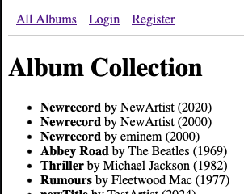
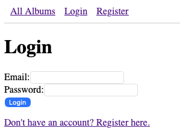
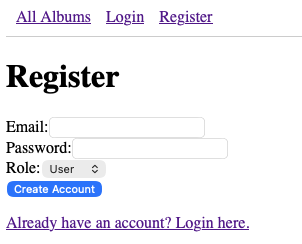

#  Album Manager API

A full-stack Express and Mongoose application for managing a personal music collection. This app includes user authentication, administrative controls, and a fully automated testing suite.

[Live Preview](https://humble-illumination-production-8ca8.up.railway.app/albums)
## Home


## Login


## Register

##  Features
- **User Authentication:** Secure login/register using Passport.js and Bcrypt.
- **Role-Based Access:** Protected routes (e.g., adding albums) restricted to Admins.
- **RESTful API:** Dedicated JSON endpoints for programmatic access.
- **Automated Testing:** Robust unit and integration tests using **Vitest** and **Supertest**.
- **Data Validation:** Strict Mongoose schemas with custom validators for unique artist/title combinations.

##  Tech Stack
- **Backend:** Node.js, Express
- **Database:** MongoDB Atlas (Mongoose ODM)
- **Templating:** Pug
- **Testing:** Vitest, Supertest
- **Auth:** Passport.js (Local Strategy)

---

##  Installation & Setup

### 1. Clone the repository
```bash
git clone https://github.com/HamzaAlshaheen/Album_Manager_API.git
cd Album_Manager_API
```

### 2. Install dependencies

```Bash
npm install 
```
### 3. Environment Variables (CRITICAL)

Create a `.env` file in the root directory. Do not share this file. You will need your own MongoDB connection string and a session secret.

```bash
# Your MongoDB Atlas Connection String
MONGO_URI=mongodb+srv://<username>:<password>@cluster.mongodb.net/albums_database

# Your Dedicated Test Database (for Vitest)
MONGO_URI_TEST=mongodb+srv://<username>:<password>@cluster.mongodb.net/unitTest

# Secret for Express Sessions
ACCESS_TOKEN_SECRET=your_random_secret_here

```

## 4. Running the App

Development Mode:

```Bash
npm run dev
```
The server will start on http://localhost:3000

## Testing
The app uses a dedicated test database to ensure your production data remains clean.

---
Run all tests:

```Bash
npm test
```